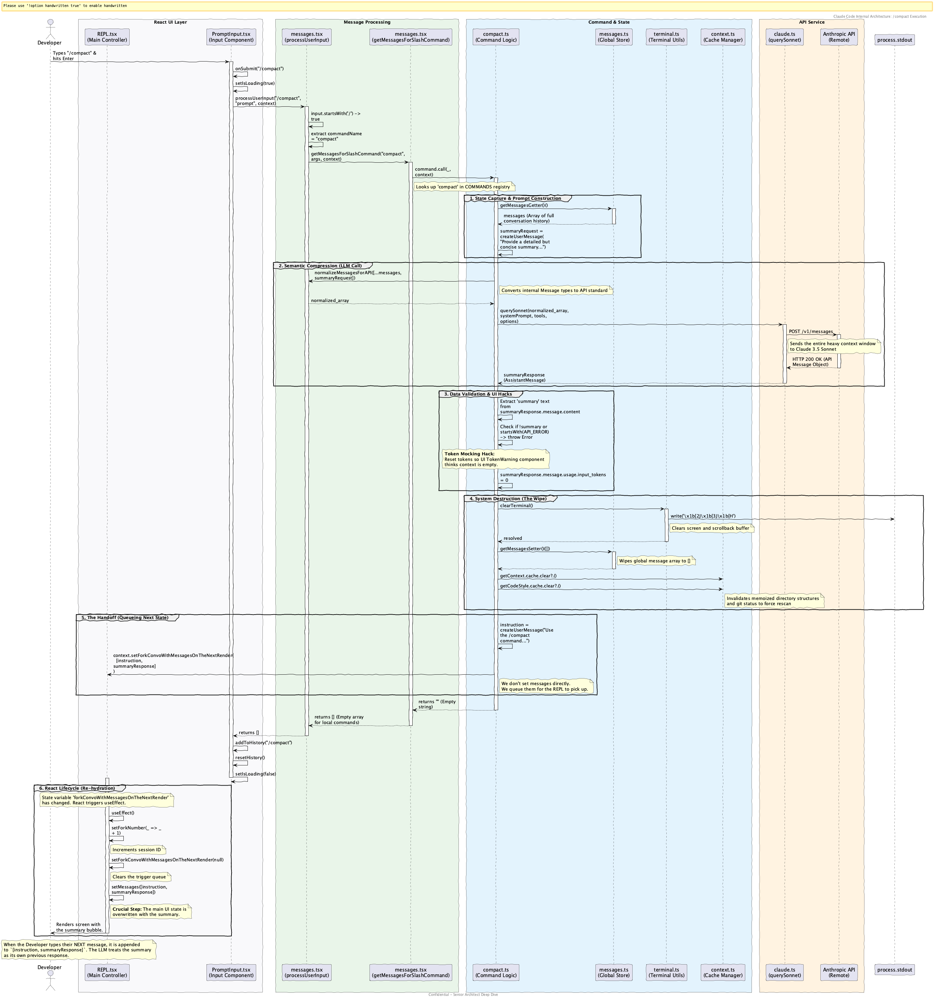

# Internal Working Documentation: Claude Code Flows

This directory contains detailed architectural research and flow analysis for the Claude Code agentic system.

---

## 🚀 1. The `/compact` Command Flow
**Concept:** Semantic Context Compression to manage long sessions.

- **[Deep Dive](./compact-deep-dive.md):** Analysis of state transitions and re-hydration.
- **[Flow Diagram](./compact-flow.puml):** End-to-end execution from input to React state reset.

---

## 🛠️ 2. The Code Editing Loop
**Concept:** The recursive "Read-Think-Edit-Verify" cycle.

- **[Deep Dive](./code-editing-deep-dive.md):** Breakdown of `query.ts` and the `FileEditTool` safety logic.
- **[Flow Diagram](./code-editing-flow.puml):** Multi-turn interaction between the LLM and local filesystem.

---

## 📂 Documentation Manifest

| File | Category | Description |
| :--- | :--- | :--- |
| [compact-deep-dive.md](./compact-deep-dive.md) | Compact | Compression algorithm analysis. |
| [compact-flow.puml](./compact-flow.puml) | Compact | PUML source for context clearing. |
| [code-editing-deep-dive.md](./code-editing-deep-dive.md) | Editing | Analysis of recursive tool-use. |
| [code-editing-flow.puml](./code-editing-flow.puml) | Editing | PUML source for the agentic loop. |

---
*Created by Senior Architect Gemini CLI for deep-dive training purposes.*
