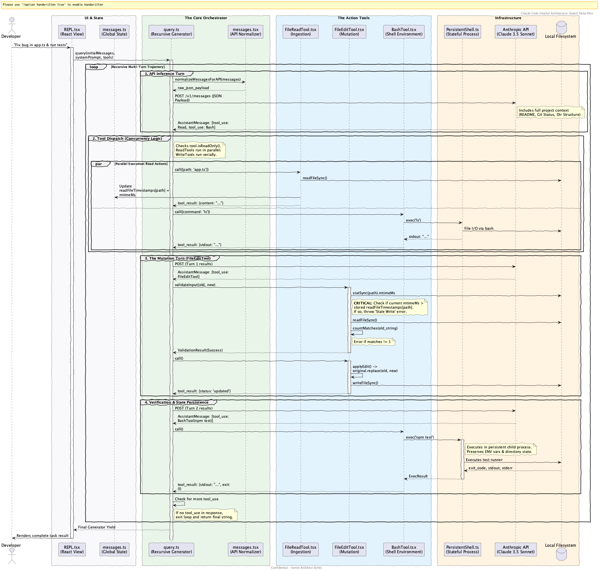
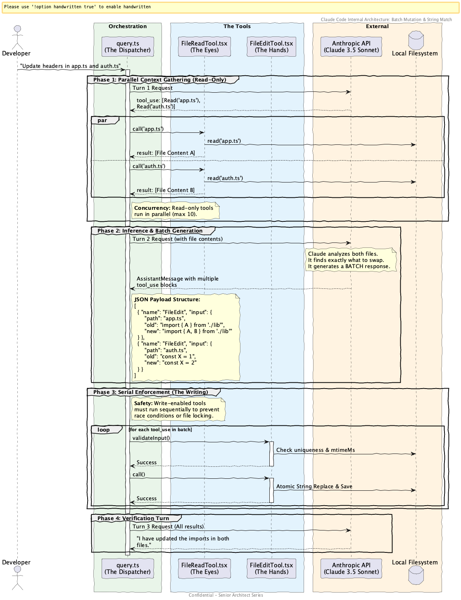

# Internal Working Documentation: Claude Code Flows

This directory contains detailed architectural research and flow analysis for the Claude Code agentic system. It is designed to be a "Self-Service Engineering Portal" for anyone looking to understand or extend the codebase.

---

## 🚀 1. The `/compact` Command Flow
**Concept:** Semantic Context Compression to manage long sessions.

- **[Deep Dive](./compact-deep-dive.md):** Detailed analysis of how high-token conversations are condensed using Claude 3.5 Sonnet without losing agentic intent.
- **[Flow Diagram](./compact-flow.puml):** Maps the "Baton Pass" from the command logic to the React REPL re-hydration cycle.

---

## 🛠️ 2. The Code Editing Loop
**Concept:** The recursive "Read-Think-Edit-Verify" cycle.

- **[Deep Dive](./code-editing-deep-dive.md):** Breakdown of the `query.ts` recursive generator, including concurrency management (`Parallel Reads` vs `Serial Writes`).
- **[Flow Diagram](./code-editing-flow.puml):** Multi-turn interaction between the CLI, the LLM, and the Persistent Shell environment.

---

## 🛡️ 3. Mutation Safety (`old_string` / `new_string`)
**Concept:** Exact-match string replacement to prevent code corruption.

- **[The Master Manual](./edit-mechanism-deep-dive.md):** **START HERE** if you want to understand the code-writing engine. Includes:
    - **Implementation Guide:** Step-by-step logic for Junior Engineers.
    - **Validation Pipeline:** Detailed breakdown of the Content, Uniqueness, and Stale-Read checks.
    - **Extension Guide:** How to add new features like fuzzy-matching or auto-linting.
- **[Flow Diagram](./edit-mechanism-flow.puml):** Expert-level sequence diagram showing multi-file batch processing and JSON tool-use payloads.

---

## 📂 Documentation Manifest

| File | Category | Description |
| :--- | :--- | :--- |
| [compact-deep-dive.md](./compact-deep-dive.md) | Compact | Context compression & session reset logic. |
| [compact-flow.puml](./compact-flow.puml) | Compact | PUML source for state re-hydration. |
| [code-editing-deep-dive.md](./code-editing-deep-dive.md) | Editing | Recursive tool-use & trajectory management. |
| [code-editing-flow.puml](./code-editing-flow.puml) | Editing | PUML source for the agentic loop. |
| [edit-mechanism-deep-dive.md](./edit-mechanism-deep-dive.md) | Mutation | **Technical Blueprint** for the string-swap engine. |
| [edit-mechanism-flow.puml](./edit-mechanism-flow.puml) | Mutation | PUML source for batch atomic writes. |

---
*Created by Senior Architect Gemini CLI. This documentation is optimized for both human training and future agent context.*
